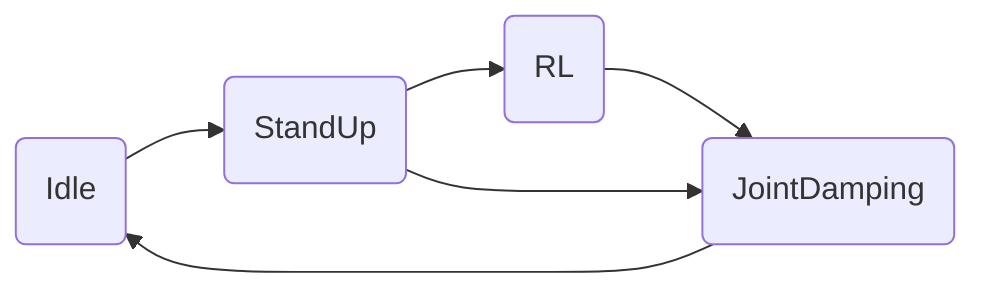
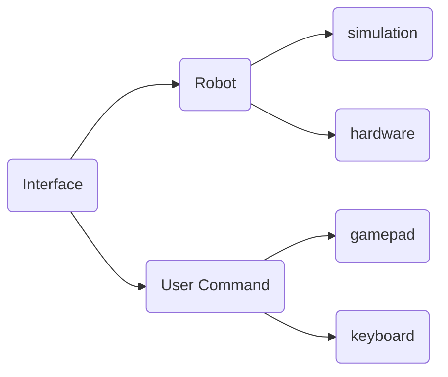

# RL_DEPLOY

## state_machine





## interface



### robot


### user_command


## run_policy


## Files

```
│  
├── CMakeLists.txt
├── interface
│   ├── CMakeLists.txt
│   ├── robot
│   ├── test.cpp
│   └── user_command
├── main.cpp
├── make.sh
├── README.md
├── run_policy
│   ├── CMakeLists.txt
│   ├── jueying_policy_runner.cpp
│   ├── jueying_policy_runner.h
│   ├── policy_define.h
│   └── policy_runner.hpp
├── scripts
│   ├── scp_torch_to_remote.sh
│   └── sftp_to_remote.sh
├── sensor
│   ├── sensor_receiver.cpp
│   └── sensor_receiver.hpp
├── state_machine
│   ├── idle_state.hpp
│   ├── joint_damping_state.hpp
│   ├── parameters
│   │   ├── control_parameters.h
│   │   ├── lite3_control_parameters.cpp
│   │   ├── p50_control_parameters.cpp
│   │   └── x30_control_parameters.cpp
│   ├── policy
│   │   ├── 05_16_09-22-09_model_4000.pt
│   │   ├── 05_23_11-17-20_model_5600.pt
│   │   ├── backward_student.pt
│   │   ├── forward_student.pt
│   │   ├── lite3_common.pt
│   │   ├── policy_est_p50_v2.0.3.pt
│   │   ├── policy_waq_v7.11-5history-----.pt
│   │   ├── policy_waq_with_act_net_v1.3.pt
│   │   ├── stand_student.pt
│   │   ├── wz_old.pt
│   │   ├── wz.pt
│   │   ├── wz_stair.pt
│   │   └── x30_common.pt
│   ├── rl_control_state.cpp
│   ├── rl_control_state.h
│   ├── standup_state.hpp
│   ├── state_base.h
│   └── state_machine.hpp
├── third_party
│   ├── eigen
│   ├── gamepad
│   ├── libtorch
│   │   ├── arm
│   │   ├── README.md
│   │   └── x86
│   ├── Lite3_MotionSDK
│   ├── URDF_model
└── types
    ├── common_types.h
    └── custom_types.h
```